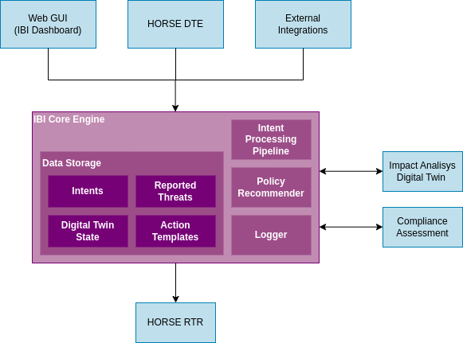

# HORSE Intent-Based Interface (IBI)

[](https://python.org)
[](https://fastapi.tiangolo.com)
[](https://github.com/HORSE-EU-Project)

The **Intent-Based Interface (IBI)** is a software prototype developed within the scope of the [HORSE project](https://horse-6g.eu). The IBI serves as a critical component for matching intents that represent the desired state of network systems and applying policies to achieve those states.

## 🎯 Overview

The IBI receives security and QoS intents through a RESTful API or graphical user interface (GUI). It processes these intents and matches them with appropriate policies that are then sent to the [RTR (Reliable Trust Resilience
) module](https://github.com/HORSE-EU-Project/RTR) for execution.

### Key Features

- **Security Intent Processing**: Handles mitigation and prevention intents for network threats
- **QoS Management**: Processes quality-of-service requirements for various network protocols
- **Digital Twin Integration**: Supports what-if analysis through IADT (Intent-Aware Digital Twin)
- **Real-time Dashboard**: Web-based interface for monitoring and management
- **RESTful API**: Comprehensive API for programmatic access
- **Docker Support**: Containerized deployment for development and production

## 🏗️ Architecture



## 🚀 Quick Start

### Prerequisites

- Python 3.13+
- Docker and Docker Compose
- [uv](https://github.com/astral-sh/uv) package manager

### Development Setup

1. **Clone the repository**
   ```bash
   git clone https://github.com/HORSE-EU-Project/IBI.git
   cd IBI
   ```

2. **Install dependencies**
   ```bash
   uv sync
   source .venv/bin/activate
   ```

3. **Run the application**
   ```bash
   uv run app/main.py
   ```

The application will be available at:
- **API**: http://localhost:8070 (Change in [Constatnts file](app/constants.py))
- **Dashboard**: http://localhost:8070

## 🐳 Docker Deployment

### Production Environment

1. Build the Docker image
```bash
# Build the Docker image
docker compose -f docker-compose.prod.yml build
```

2. Adjust the configurations according to IP addresses used in the testbed
```
vim ~/config.yml
```

# Run the production environment
docker compose -f docker-compose.prod.yml up
```

### Development Environment (deprecated)

```bash
# Build and run development environment
docker compose -f docker-compose.dev.yml build
docker compose -f docker-compose.dev.yml up
```

> **Note**: The development environment uses volume mounting for live code reloading, while production creates a snapshot of the codebase.

## 📡 API Reference

### Security Intents

#### Mitigation Intent
```bash
curl -X POST http://localhost:8070/intents \
  -H "Content-Type: application/json" \
  -d '{
    "intent_type": "mitigation",
    "threat": "ddos_dns",
    "host": ["dns-c1", "dns-c2", "gnb", "upf"],
    "duration": 3000
  }'
```

#### Prevention Intent
```bash
curl -X POST http://localhost:8070/intents \
  -H "Content-Type: application/json" \
  -d '{
    "intent_type": "prevention",
    "threat": "dns_amplification",
    "host": ["0.0.0.0", "1.1.1.1", "8.8.8.8"],
    "duration": 1200
  }'
```

## 🔧 Configuration

The application uses YAML configuration files located in `config.yml`. Key configuration sections include:

- **External Module URLs**: RTR, IADT, CAS, CKB endpoints
- **Mitigation Actions**: Predefined actions for different threat types
- **Testbed Settings**: Environment-specific configurations

### Supported Threat Types

- `ddos_dns` - DNS-based DDoS attacks
- `dns_amplification` - DNS amplification attacks
- `ntp_ddos` - NTP-based DDoS attacks
- `ddos_download_link` - Download link DDoS attacks
- `multidomain` - Multi-domain attacks
- `pfcp_deletion/establishment/modification` - PFCP signaling attacks
- `nf_exposure` - Network function exposure attacks
- `poisoning_and_amplification` - DNS poisoning and amplification

## 🧪 Check if the module is online

Run the provided test files:

```bash
# REST API tests
curl -X GET http://localhost:8070/ping
```

## 📊 Monitoring

Access the web dashboard at `http://localhost:8070/dashboard` for:
- Real-time intent processing status
- System performance metrics
- Threat mitigation statistics

This project is developed under the HORSE EU project framework.

## 🔗 Related Projects

- [HORSE RTR Module](https://github.com/HORSE-EU-Project/RTR) - Reliable Trust Resilience
- [HORSE IADT Module](https://github.com/HORSE-EU-Project/IADT) - Impact Analisys Digital Twin
- [HORSE CAS Module](https://github.com/HORSE-EU-Project/CAS) - Compliance Assessment Component

---

**HORSE Project** - Horizon Europe Research and Innovation Programme
This repository is part of the HORSE project. HORSE project has received funding from the 
Smart Networks and Services Joint Undertaking (SNS JU) under the European Union’s Horizon 
Europe research and innovation programme under Grant Agreement No 101096342.

For more details about the project, visit the HORSE project [website](https://www.horse-6g.eu/) 
or the [LinkedIn page](https://www.linkedin.com/company/horse-project-eu/).